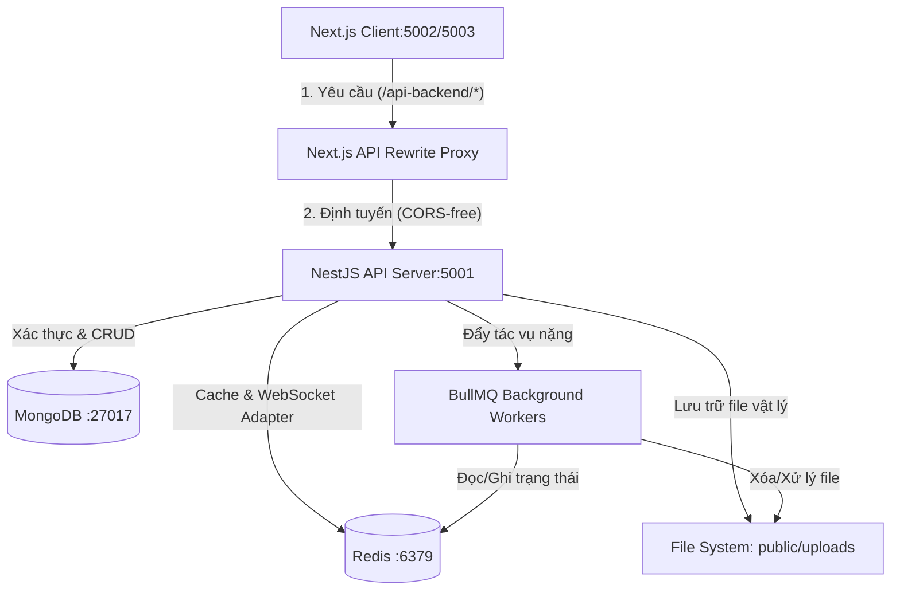

# Hệ thống Workflows & Tài liệu Kỹ thuật 

Chào mừng bạn đến với tài liệu kiến trúc quy trình (Workflows) của dự án **Base Code**. Tài liệu này giải thích chi tiết cơ chế vận hành, luồng dữ liệu (data flow) từ giao diện người dùng (Client Next.js) qua các API gateway (NestJS), dịch vụ nền (Background Queue/Redis) và cơ sở dữ liệu (MongoDB).

---

## Danh mục quy trình chi tiết

Để tìm hiểu chi tiết luồng xử lý của từng chức năng, vui lòng truy cập các liên kết dưới đây:

### 1. [Xác thực & Phân quyền (Authentication & Authorization)](file:///Users/nguyendam/Documents/Study/base-code/docs/workflows/authentication.md)
- Quy trình đăng nhập/đăng ký cục bộ bằng tài khoản/mật khẩu.
- Xác thực và liên kết tài khoản Google OAuth.
- Cơ chế quản lý vòng đời JWT và phân quyền người dùng (RBAC - Role-Based Access Control) sử dụng Guards/Decorators.

### 2. [Quản lý Người dùng & Hồ sơ (User Management & Profile)](file:///Users/nguyendam/Documents/Study/base-code/docs/workflows/user_management.md)
- Qu trình cập nhật hồ sơ cá nhân và tự phục vụ (Self-service).
- Quy trình tải lên và tối ưu hóa ảnh đại diện bằng thư viện `Sharp`.
- Quản trị viên (Admin) quản lý người dùng (CRUD, Khóa/Mở khóa tài khoản).

### 3. [Tải lên & Xử lý File, Media (File & Media Processing)](file:///Users/nguyendam/Documents/Study/base-code/docs/workflows/file_media_processing.md)
- Luồng tải lên file đồng bộ/bất đồng bộ.
- Xử lý nén ảnh tự động và chuyển đổi WebP.
- Cơ chế transcode video và trích xuất ảnh xem trước (thumbnail) sử dụng `FFmpeg/FFprobe` chạy nền.
- Tiến trình chạy ẩn dọn dẹp file thừa sử dụng hàng đợi `BullMQ`.

### 4. [Kết nối Real-time qua WebSocket (Real-time Socket.IO)](file:///Users/nguyendam/Documents/Study/base-code/docs/workflows/realtime_websocket.md)
- Vòng đời kết nối WebSocket client/server.
- Chia sẻ phiên làm việc (Session) thông qua Redis Adapter giúp phân tải (Horizontal Scaling).
- Luồng broadcast thông tin trạng thái bảo trì và thông báo trực tiếp.

### 5. [Chế độ Bảo trì & Sao lưu (Maintenance & Backup)](file:///Users/nguyendam/Documents/Study/base-code/docs/workflows/maintenance_backup.md)
- Kịch bản kích hoạt chế độ bảo trì, whitelist IP, và bộ lọc middleware kiểm soát toàn cục.
- Quy trình trích xuất cơ sở dữ liệu MongoDB sang định dạng JSON, nén ZIP động dạng luồng (`ZipFile` stream) và tải về tức thì.

### 6. [Giám sát & Quan sát hệ thống (Monitoring & Observability)](file:///Users/nguyendam/Documents/Study/base-code/docs/workflows/monitoring_observability.md)
- Bắt lỗi toàn cục (Global Exception Filters) và ghi nhận vào MongoDB.
- Ghi nhận hiệu năng API qua Slow Request Interceptor.
- Cơ chế báo cáo lỗi từ phía Client-side (frontend) về backend thông qua kỹ thuật `sendBeacon` / `unhandledrejection`.
- Giao diện Admin trực quan để xem log thời gian thực và quản lý tài nguyên.

---

## Bản đồ luồng thông tin tổng quát (High-level Architecture)

Tài liệu này được biên soạn nhằm phục vụ các nhà phát triển hệ thống nắm bắt nhanh cấu trúc hoạt động thực tế, giúp đẩy nhanh quá trình gỡ lỗi và phát triển các tính năng mở rộng một cách nhất quán.
