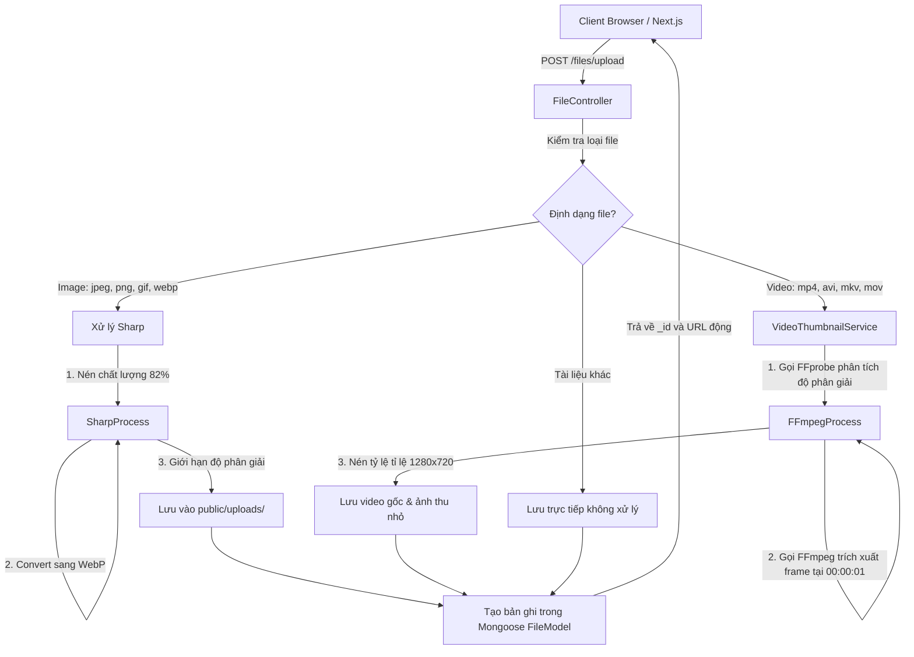
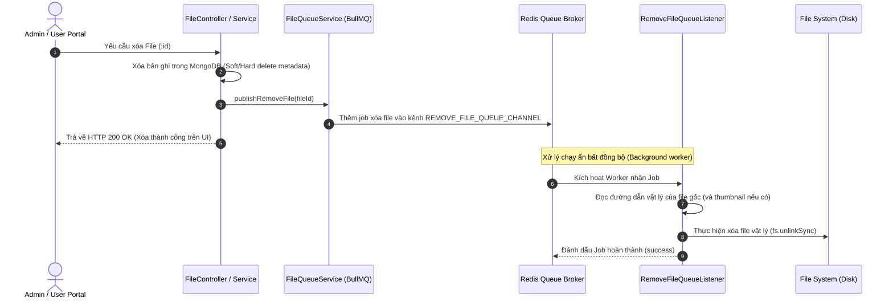

# Quy trình Tải lên & Xử lý File, Media (File & Media Processing)

Quy trình này mô tả luồng tải lên tệp tin, tối ưu hóa hình ảnh bằng `Sharp`, trích xuất ảnh xem trước (thumbnail) video bằng `FFmpeg`, và tiến trình xóa file vật lý bất đồng bộ sử dụng hàng đợi `BullMQ`.

---

## 1. Luồng tải lên và xử lý tệp tin (File Upload Flow)

Hệ thống hỗ trợ tải lên nhiều loại định dạng khác nhau (Ảnh, Video, Tài liệu thường) thông qua API dùng chung [FileController](file:///Users/nguyendam/Documents/Study/base-code/api/src/modules/file/controllers/file.controller.ts).



---

## 2. Xử lý tối ưu hóa ảnh bằng Sharp
Khi tệp tải lên được xác định là ảnh:
- Backend sử dụng thư viện **Sharp** để tối ưu hóa nhằm tiết kiệm băng thông và tăng tốc độ tải trang ở frontend.
- Cấu hình kích thước tối đa và chất lượng nằm ở `api/src/config/image.ts` (mặc định tối đa `1920x1080`, chất lượng nén `82%`).
- Định dạng xuất ra luôn là `.webp` (WebP) có khả năng nén vượt trội so với JPEG/PNG truyền thống mà chất lượng không giảm đáng kể.

---

## 3. Trích xuất ảnh xem trước (Thumbnail) cho Video qua FFmpeg

Khi tệp tải lên là video:


### Luồng xử lý chi tiết:
- Sử dụng gói nhị phân static `ffmpeg-static` và `ffprobe-static` tích hợp sẵn trong hệ thống (không cần cài đặt ffmpeg lên OS của server).
- **Phân tích (FFprobe)**: [VideoThumbnailService](file:///Users/nguyendam/Documents/Study/base-code/api/src/modules/file/services/video-thumbnail.service.ts) gọi `ffprobe` dưới dạng tiến trình con (`child_process.spawn`) để đọc thông tin chiều rộng và chiều cao gốc của video.
- **Tính toán kích thước thumbnail**: Kích thước ảnh xem trước được điều chỉnh theo tỷ lệ khung hình gốc nhưng giới hạn trong khung hình chữ nhật `1280x720` (được làm tròn số chẵn cho tương thích phần cứng).
- **Trích xuất ảnh (FFmpeg)**: Tiến trình con `ffmpeg` được kích hoạt với tham số lấy mẫu:
  ```bash
  ffmpeg -y -ss 00:00:01 -i <video_path> -frames:v 1 -vf scale=<width>:<height> <thumbnail_path>
  ```
- Kết quả tạo ra một ảnh tĩnh `.jpg` xem trước lưu song song với video. `FileMetadata` được cập nhật liên kết đến ảnh thumbnail này.

---

## 4. Quy trình Xóa file bất đồng bộ qua BullMQ

Để tránh làm chậm luồng xử lý API chính khi người dùng xóa file (hoặc khi dọn dẹp file rác), hệ thống chuyển tác vụ xóa file vật lý trên ổ đĩa cứng xuống hàng đợi (Queue) xử lý chạy ẩn.



### Các hàng đợi được định nghĩa:
- **`REMOVE_FILE_QUEUE_CHANNEL`**: Xử lý xóa một tệp đơn lẻ.
- **`REMOVE_MANY_FILE_QUEUE_CHANNEL`**: Xử lý xóa danh sách nhiều tệp (ví dụ khi xóa người dùng hàng loạt, xóa thư mục).

Quy trình này đảm bảo I/O đĩa cứng không bao giờ chặn luồng xử lý request HTTP chính của người dùng, giúp cải thiện đáng kể hiệu suất ứng dụng.
