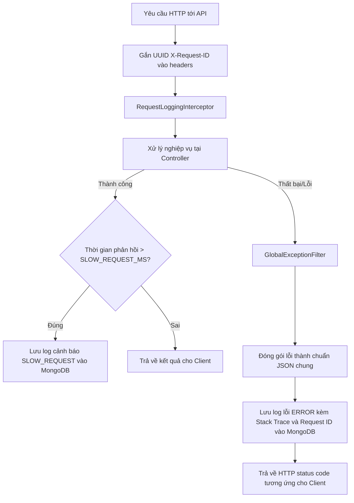
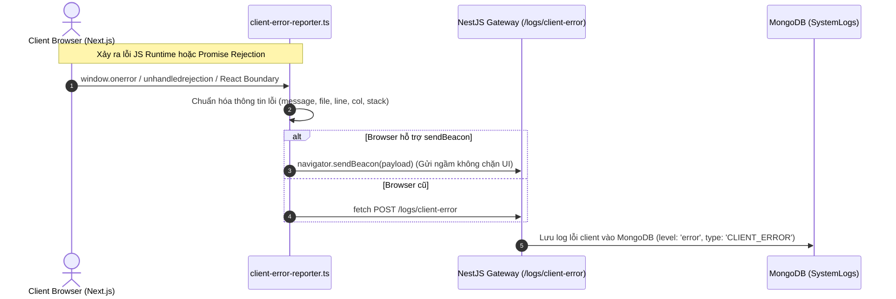

# Giám sát & Quan sát hệ thống (Monitoring & Observability)

Dự án cung cấp giải pháp giám sát tập trung tự xây dựng, bao gồm việc ghi nhận lỗi backend tự động, phát hiện request phản hồi chậm, nhận và tổng hợp lỗi runtime từ trình duyệt client (frontend), và một giao diện xem log chuyên dụng cho quản trị viên.

---

## 1. Cơ chế giám sát yêu cầu ở Backend (NestJS)

Quy trình giám sát hoạt động của API đi qua hai chốt chặn chính: **RequestLoggingInterceptor** và **GlobalExceptionFilter**.

### 1.1. Request Logging Interceptor ([request-logging.interceptor.ts](file:///Users/nguyendam/Documents/Study/base-code/api/src/modules/monitoring/interceptors/request-logging.interceptor.ts))
- Ghi nhận thời gian bắt đầu và kết thúc của mỗi API request.
- Nếu thời gian xử lý vượt quá cấu hình `SLOW_REQUEST_MS` (ví dụ: `1000ms`), một bản ghi log cảnh báo mức `warn` với mã loại `SLOW_REQUEST` sẽ được tự động lưu lại.
- Lưu trữ các thông tin chi tiết: HTTP method, URL, Query params, Request body (loại bỏ mật khẩu nhạy cảm), IP client, và tác nhân người dùng (User-Agent).

### 1.2. Global Exception Filter ([global-exception.filter.ts](file:///Users/nguyendam/Documents/Study/base-code/api/src/modules/monitoring/filters/global-exception.filter.ts))
- Bắt giữ mọi lỗi xảy ra trong quá trình xử lý của NestJS (bao gồm lỗi HTTP chuẩn như `404 Not Found`, `400 BadRequest` và các lỗi logic runtime không mong muốn như `NullPointerException`, lỗi database).
- Tự động bóc tách thông báo lỗi, mã trạng thái và **Stack Trace** (nếu là lỗi hệ thống `500`).
- Ghi log mức độ `error` vào database, đính kèm `X-Request-ID` và ID người dùng hiện tại (nếu đã xác thực) để dễ dàng đối chiếu.

---

## 2. Báo cáo lỗi từ phía Client-side (Frontend Beacon)

Để quản trị viên biết được người dùng đang gặp lỗi giao diện hay lỗi Javascript gì trên trình duyệt của họ, frontend (cả `admin` và `user` portal) được cài đặt cơ chế tự động báo cáo lỗi.

### Điểm tối ưu:
- **`navigator.sendBeacon`**: Phương thức này giúp gửi dữ liệu thống kê lỗi về backend một cách bất đồng bộ ngay cả khi người dùng đang đóng tab hoặc chuyển trang. Trình duyệt đảm bảo dữ liệu sẽ được gửi đi thành công mà không gây ảnh hưởng đến hiệu năng hay trải nghiệm tắt trình duyệt của người dùng.
- **React Error Boundary**: Các component React nặng đều được bọc trong `AppErrorBoundary` để nếu có crash giao diện, client vẫn hiển thị màn hình fallback thân thiện và đồng thời gửi báo cáo lỗi về backend ngay lập tức.

---

## 3. Quản lý và Truy vấn Log (System Logs Viewer)

Quản trị viên có thể xem trực quan toàn bộ log hệ thống tại trang `System Logs` của Admin portal.

- **Dữ liệu log lưu ở Schema**: `SystemLog` ([system-log.schema.ts](file:///Users/nguyendam/Documents/Study/base-code/api/src/modules/monitoring/schemas/system-log.schema.ts)) trong MongoDB.
- **Bộ lọc mạnh mẽ**: Tìm kiếm log theo `X-Request-ID`, lọc theo cấp độ (`info`, `warn`, `error`), loại nguồn (`backend`, `client`), từ khóa trong nội dung log và khoảng thời gian.
- **Thống kê trực quan**: Dashboard hiển thị tỷ lệ lỗi/cảnh báo theo thời gian thực giúp quản trị viên nhanh chóng phát hiện nếu có đợt tấn công dò quét (quá nhiều lỗi `404` hoặc `400`) hoặc hệ thống đang quá tải (xuất hiện nhiều cảnh báo `SLOW_REQUEST`).
