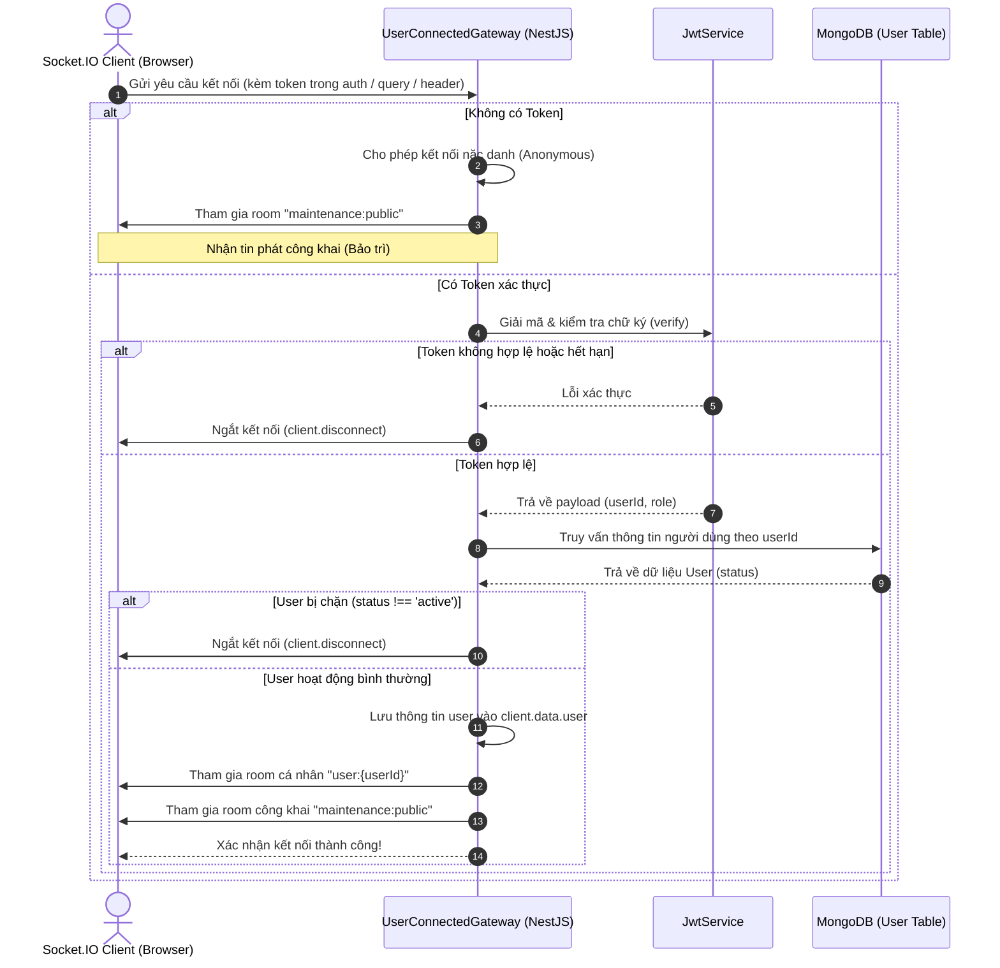

# Kết nối Real-time qua WebSocket (Real-time Socket.IO)

Hệ thống tích hợp cổng kết nối hai chiều thời gian thực (WebSocket Server) dựa trên Socket.IO kết nối cùng với Redis Pub/Sub adapter, cho phép truyền tải dữ liệu và sự kiện tức thì (tương tác trực tuyến, thông báo hệ thống, cập nhật bảo trì) đồng thời đảm bảo khả năng mở rộng quy mô ngang (Horizontal Scaling).

---

## 1. Cơ chế bắt tay xác thực kết nối (Connection Handshake)

Cổng kết nối được thiết lập tại [UserConnectedGateway](file:///Users/nguyendam/Documents/Study/base-code/api/src/modules/websocket/gateways/user-connected.gateway.ts). Quy trình kiểm soát kết nối như sau:



---

## 2. Mở rộng quy mô với Redis Adapter (Horizontal Scaling)

Khi triển khai trên môi trường Production bằng PM2 (Cluster Mode) hoặc trên nhiều máy chủ khác nhau đứng sau Load Balancer, các Client sẽ kết nối tới các Node tiến trình backend khác nhau.

### Vấn đề:
Nếu Node A muốn gửi thông báo cho người dùng X nhưng người dùng X lại đang kết nối WebSocket với Node B, Node A sẽ không thể giao tiếp trực tiếp.

### Giải pháp (Redis Pub/Sub Adapter):
Dự án sử dụng [RedisIoAdapter](file:///Users/nguyendam/Documents/Study/base-code/api/src/modules/websocket/redis-io.adapter.ts) để giải quyết vấn đề này.

```mermaid
graph TD
    subgraph Client Layer
        C1[Client 1]
        C2[Client 2]
    end

    subgraph Node Layer (PM2 Cluster)
        NodeA[NestJS Node A :5001]
        NodeB[NestJS Node B :5001]
    end

    subgraph Broker Layer
        Redis[(Redis Pub/Sub :6379)]
    end

    C1 <-->|WebSocket| NodeA
    C2 <-->|WebSocket| NodeB

    NodeA <-->|Publish / Subscribe| Redis
    NodeB <-->|Publish / Subscribe| Redis
```

### Quy trình đồng bộ hóa sự kiện:
1. Khi Node A gọi hàm `emitToAll('event_name', data)` hoặc `emitToUser('userId', 'event_name', data)`:
2. Thay vì chỉ gửi tới các client đang kết nối cục bộ của nó, `RedisIoAdapter` sẽ bọc sự kiện đó thành một thông điệp và Publish vào Redis.
3. Redis chuyển tiếp (broadcast) thông điệp này tới toàn bộ các instance backend đang subscribe kênh.
4. Node B nhận được thông điệp từ Redis, giải nén và gửi sự kiện đó qua WebSocket tới Client 2 đang giữ kết nối cục bộ với nó.

---

## 3. Các kịch bản sự kiện Real-time chính

### 3.1. Trạng thái Trực tuyến / Ngoại tuyến (Online/Offline Tracking)
- **Client gửi**:
  - `user:online`: Khi tab trình duyệt active hoặc đăng nhập thành công. Giao diện frontend sẽ gửi yêu cầu cập nhật danh sách hoạt động.
  - `user:offline`: Khi tab trình duyệt ẩn (blur), đóng cửa sổ hoặc đăng xuất.
- **Backend xử lý**: Lưu vết kết nối tại `SocketUserService` và quản lý ánh xạ `userId <-> client.id`.

### 3.2. Thông báo Bảo trì trực tiếp (Live Maintenance Broadcaster)
- Khi Admin bật/tắt chế độ bảo trì hoặc sửa tin nhắn bảo trì:
- Hệ thống kích hoạt sự kiện `maintenance:update` tới tất cả các client đang online (thuộc room `maintenance:public`).
- Phía Client (Next.js) nhận được sự kiện này qua kết nối Socket.IO Client sẽ tự động trigger gọi lại API để kiểm tra trạng thái bảo trì mới, kích hoạt màn hình chặn bảo trì hoặc tự động tải lại trang nếu hệ thống mở cửa trở lại mà không bắt người dùng F5 thủ công.
- Tác vụ được thực hiện tự động và lập tức.
