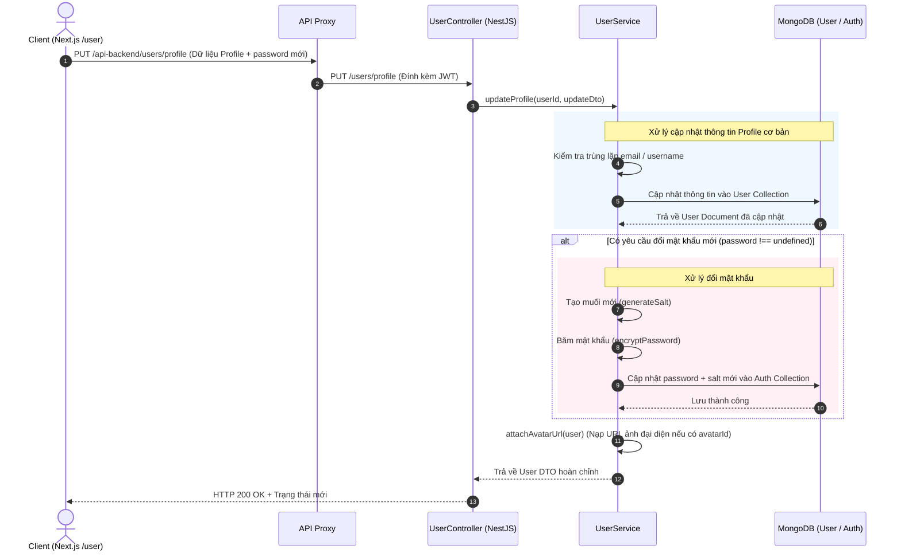

# Quy trình Quản lý Người dùng & Hồ sơ (User Management & Profile)

Quy trình này mô tả cách thức quản lý vòng đời người dùng, cập nhật thông tin cá nhân (Self-service), và các thao tác quản trị từ phía Admin portal.

---

## 1. Luồng cập nhật Hồ sơ & Mật khẩu (Self-service Profile Update)

Người dùng có thể tự cập nhật thông tin cá nhân (Tên, Username, Email, Điện thoại, Ảnh đại diện) và đổi mật khẩu từ màn hình cài đặt tài khoản của User portal.

---

## 2. Quy trình xử lý ảnh đại diện (Avatar Process)

Khi người dùng chọn và tải lên ảnh đại diện mới:

### Luồng xử lý chi tiết:
1. **Upload File**: File ảnh được gửi qua endpoint `POST /api-backend/files/upload`. 
2. **Nén & Tối ưu hóa**: Thư viện `Sharp` nén ảnh thành định dạng `WebP` với chất lượng nén `82%` và resize chiều rộng tối đa `1920px`, lưu trữ tại thư mục [public/avatars/](file:///Users/nguyendam/Documents/Study/base-code/api/public/avatars) hoặc `public/uploads/`.
3. **Lưu Metadata**: Một bản ghi mới được tạo trong bảng `files` để lấy `_id` (được gọi là `avatarId`).
4. **Cập nhật User**: Frontend thực hiện gọi API cập nhật profile gửi kèm `avatarId`.
5. **Gán URL động**: Khi backend trả về thông tin User, `UserService` gọi hàm `attachAvatarUrl` để đọc thông tin file từ database và tạo ra thuộc tính động `avatarUrl` (ví dụ: `http://localhost:5001/uploads/avatars/abc.webp`) giúp frontend hiển thị trực tiếp.

---

## 3. Luồng quản trị người dùng từ Admin Dashboard

Quản trị viên có toàn quyền xem danh sách, tạo mới, chỉnh sửa thông tin và chặn (block) tài khoản người dùng thông qua [AdminUserService](file:///Users/nguyendam/Documents/Study/base-code/api/src/modules/user/services/admin-user.service.ts).

### 3.1. Truy vấn danh sách có phân trang và bộ lọc:
- **Endpoint**: `GET /api-backend/admin/users?page=1&limit=10&q=keyword&role=user&status=active`
- **Xử lý**:
  - `AdminUserService` phân tích các tham số tìm kiếm và chuyển đổi thành MongoDB Query (`$regex` không phân biệt hoa thường để tìm tên/email/username).
  - Sử dụng `$facet` hoặc thực hiện đồng thời `countDocuments()` và `find().skip().limit().sort()` để trả về danh sách phân trang kèm tổng số bản ghi.

### 3.2. Chặn và Mở khóa tài khoản (Block / Unblock):
- **Endpoint**: `POST /api-backend/admin/users/:id/status` (gửi kèm `{ status: 'blocked' | 'active' }`).
- **Luồng xử lý**:
  1. Admin gửi yêu cầu cập nhật trạng thái của User `:id`.
  2. Hệ thống kiểm tra vai trò người thực hiện (Chỉ cho phép `admin` hoặc `super-admin`).
  3. Cập nhật thuộc tính `status` trong `User` collection.
  4. Nếu status được đặt là `blocked`:
     - Khi người dùng bị chặn thực hiện request tiếp theo, `AuthService` hoặc `AuthGuard` sẽ kiểm tra trạng thái của user trong DB.
     - Phát hiện `status !== 'active'`, quăng lỗi `403 Forbidden` ngay lập tức, vô hiệu hóa phiên làm việc của user đó dù JWT vẫn còn hạn.

---

## 4. Các File Code chính
- Xử lý nghiệp vụ cá nhân: [user.service.ts](file:///Users/nguyendam/Documents/Study/base-code/api/src/modules/user/services/user.service.ts)
- Xử lý nghiệp vụ quản trị: [admin-user.service.ts](file:///Users/nguyendam/Documents/Study/base-code/api/src/modules/user/services/admin-user.service.ts)
- API endpoint cá nhân: [user.controller.ts](file:///Users/nguyendam/Documents/Study/base-code/api/src/modules/user/controllers/user.controller.ts)
- API endpoint quản trị: [admin-user.controller.ts](file:///Users/nguyendam/Documents/Study/base-code/api/src/modules/user/controllers/admin-user.controller.ts)
